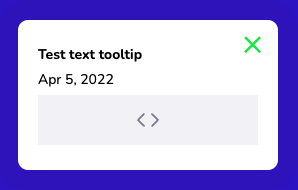

# Wrapping HTML Elements in Custom Tags

* Overview 
  * For a collection of elements that have no parent div around them, but require CSS manipulation.
  * This example creates a new div around a specified element, then sets the attribute to be a custom Id and Id value.
  * In addition to the JavaScript file, there is a CSS file specifying that the border of the newly introduced div should be larger than the border-radius, in order to create a border with square outer edges. This occurs while the inside of the div maintains its rounded edges. See example image below.

* How to Use
  * This code is meant to be used in the Code Block of a guide step.
  * Copy and paste the CSS & JS into a code block.
  * Validate that both the Id in your CSS file and the Id your JS file setAttribute() function, are named similairly.
  * Note that jQuery is not used as customers would need to have the library linked in their app. A similar solution may look like the below, though is not advised.
    * > `$( "#pendo-guide-container" ).wrap($('
'));`

## Example

